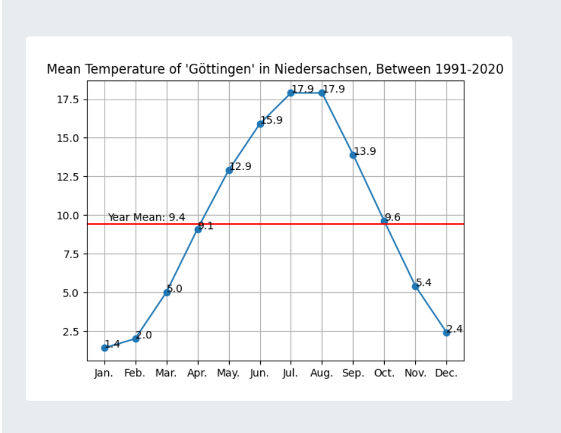

### Mean Temperature
A django project to fetch the data from [opendata.dwd.de](https://opendata.dwd.de/climate_environment/CDC/observations_germany/climate/multi_annual/mean_91-20/)
and draw a diagram of given station.

#### How to run
 - Build the docker image: `docker build -t weather .` 
 - Run the container: `docker run -p 8000:8000 -v ./db.sqlite3:/web/db.sqlite3 weather -d`

#### How to run tests
 - Install dependencies: `python -m pip install -r requirements.txt`
 - Run the tests: `pytest web/tests.py`

#### How to draw a diagram
 - Select a station from the list of provinces in the first page
 - It will draw a diagram like

    